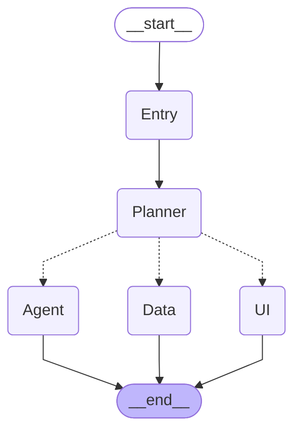

# MMUI_DIR — Current Graph

The diagram below is generated automatically from LangGraph.

```mermaid
---
config:
  flowchart:
    curve: linear
---
graph TD;
	__start__([<p>__start__</p>]):::first
	Entry(Entry)
	Planner(Planner)
	UI(UI)
	Data(Data)
	Agent(Agent)
	__end__([<p>__end__</p>]):::last
	Entry --> Planner;
	Planner -.-> Agent;
	Planner -.-> Data;
	Planner -.-> UI;
	__start__ --> Entry;
	Agent --> __end__;
	Data --> __end__;
	UI --> __end__;
	classDef default fill:#f2f0ff,line-height:1.2
	classDef first fill-opacity:0
	classDef last fill:#bfb6fc

```
