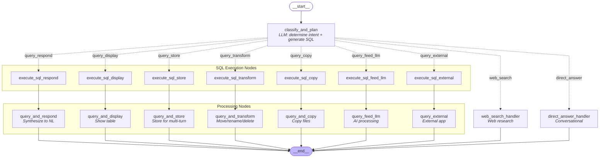

# app_2 — Branching LangGraph Workflow

This diagram shows the branching workflow in `app_2/` that classifies user intent and routes to specialized processing nodes.

## Action Types

| Action Type | Description | Requires SQL |
|-------------|-------------|--------------|
| `query_respond` | Return single value as natural language | Yes |
| `query_display` | Display table of files to user | Yes |
| `query_store` | Store table for multi-turn dialog | Yes |
| `query_transform` | Move, rename, or delete files | Yes (source_path, dest_path) |
| `query_copy` | Copy files | Yes (source_path, dest_path) |
| `query_feed_llm` | Feed results to LLM for AI processing | Yes |
| `query_external` | Run external application per row | Yes |
| `web_search` | Perform web research | No |
| `direct_answer` | Respond directly (greetings, chat) | No |

## Example Queries by Action Type

### query_respond
- "How many MP3 files do I have?"
- "Do I have any files older than a month?"
- "How many minutes of Beatles music do I have?"

### query_display
- "Show me all files in C:/Music/Beatles" → filename column only (single pinned directory)
- "List all Beatles songs in C:/Music/Beatles" → filename only, even though filter is on tag_artist
- "List all text files I have" → path + filename columns (no directory pinned, scans everywhere)
- "Show MP3s in C:/Music and its subfolders" → path + filename columns (recursive)
- Timestamps are shown human-readable by default (e.g. `2026-01-10 12:00:00`)

### query_store
- "Remember the MP3 files in my Beatles folder"

### query_transform
- "Delete all .tmp files in C:/Downloads/Temp"
- "Move all files from C:/Downloads to C:/Archive"
- "Rename all files in C:/Projects/Archive by removing the 'archive_' prefix"

### query_copy
- "Copy all jpg files from C:/Pictures to C:/Backup"
- "Update C:/Photos/Backup so it has all the files from C:/Photos/Camera — only copy files not already there" (sync copy using NOT EXISTS)

### query_feed_llm
- "Use AI to suggest better names for my vacation photos"
- "Remove the numeric prefix from all tracks in C:/Music/Playlist" (variable-length prefix — SQL can't do this)

### query_external
- "Run ffmpeg to convert all MP3 files to WAV"

### web_search
- "What is the current price of the Beatles vinyl on Amazon?"

### direct_answer
- "Hello, how are you?"
- "What can you help me with?"
- "What time is it?"